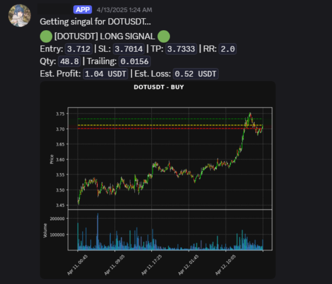

# Bybit Automation Trading

>⚠️ Disclaimer:
>This repository is for educational purposes only. The code provided is not financial advice and should not be used for real trading without thorough testing and a full understanding of the risks involved. Always do your own research and consult a licensed financial advisor before making investment decisions.

## Overview
This repository contains a Python script for automating trading on the Bybit exchange using the Bybit API. The script is designed to place buy and sell orders based on specific conditions and manage open positions.

## Features

- Connect to Bybit API using WebSocket and REST API
- Fetch market data and account information
- Place buy and sell orders based on market conditions
- Manage open positions and close them based on specific conditions
- Using Discord Webhook to send notifications about trades and errors
 
- Generate CSV file with trade history
 
- Generate Chart using Matplotlib and save it as an image
 
